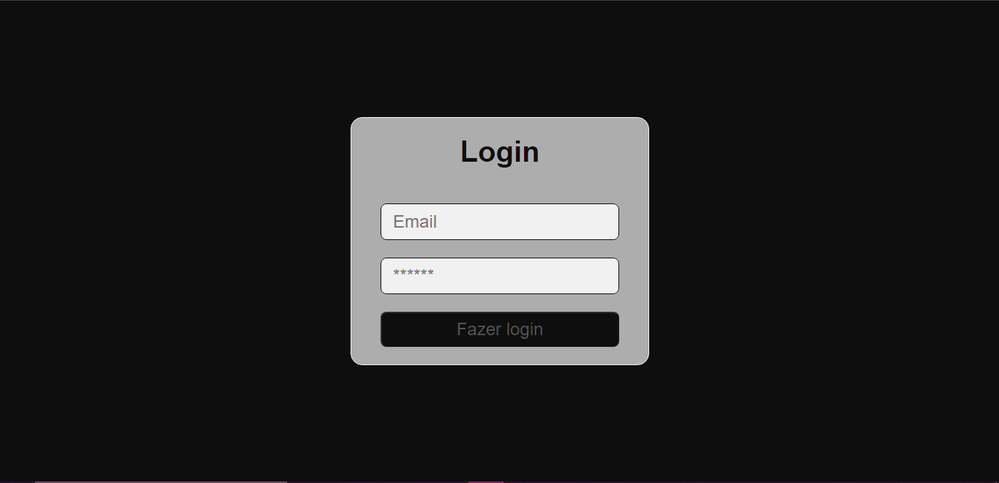
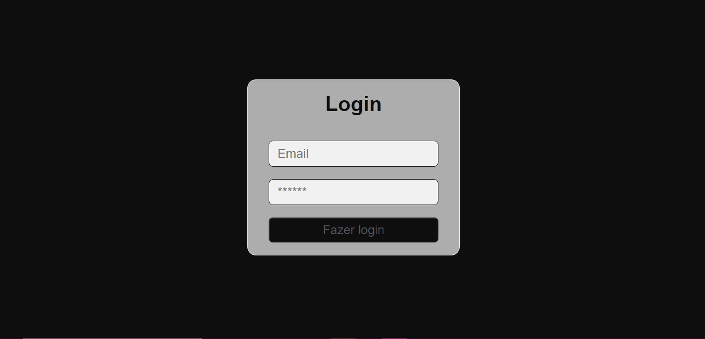

# Validação de Login com TS
Projeto de uma página de login, onde a validação deveria ser feita para permitir ou não o login, que era o quarto e último desafio do Bootcamp Orange Tech+.

----

## 👩‍💻 O Projeto

Nos foi proposto que desenvolvessemos junto ao Pablo uma formulário de Login e fizessemos uma validação para confirmar se os dados estavam corretos, exibindo mensagens de erros coerentes para os usuários. Além disso, fomos desafiados a alterar o botão de acordo com o status (válido ou não) do formulário.

----

## 🔧 Tecnologias Usadas

- HTML
- TSX
- Typescript
- React
- Styled Components
- React Hook Forms
- Yup

## 🔗 Acesso 

Para acessar a Wiki, basta <a href="https://validacao-com-ts.vercel.app/">clicar aqui</a>!

----

## 🤳 Demo

| Versão Desktop |
| -------------- |
|  |
|